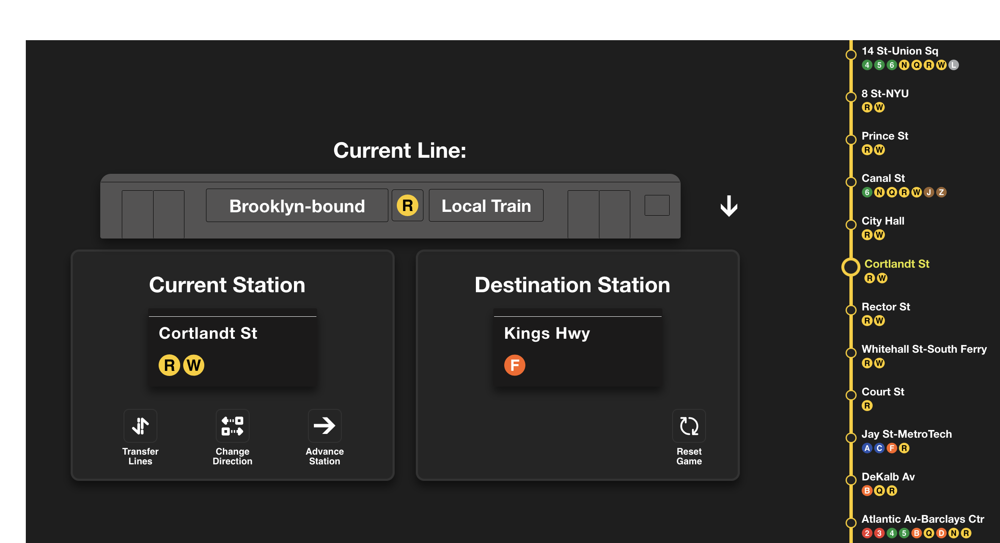

# NYC Subway Journey Game React App


- [NYC Subway Journey Game React App](#nyc-subway-journey-game-react-app)
    - [Screenshots](#screenshots)
- [Running the project](#running-the-project)
  - [Play online](#play-online)
  - [Running the project locally with Docker](#running-the-project-locally-with-docker)
      - [1. Pull the Docker image](#1-pull-the-docker-image)
      - [2. Run the Docker container](#2-run-the-docker-container)
      - [3. Open the application](#3-open-the-application)
  - [Running the project locally with Node.js](#running-the-project-locally-with-nodejs)
      - [1. Clone the repository](#1-clone-the-repository)
      - [2. Install dependencies and run project](#2-install-dependencies-and-run-project)
  - [How to play](#how-to-play)
    - [Initialization](#initialization)
    - [Gameplay](#gameplay)
    - [Configuration settings](#configuration-settings)
    - [Conductor mode](#conductor-mode)
    - [Keyboard shortcuts](#keyboard-shortcuts)
  - [](#)


### Screenshots
|  |  |
| -----------------------------------------------------------| ---------------------------------------------------------- |
<br>


# Running the project


## Play [online](https://nolansmug.github.io/)
- Currently hosted on GitHub Pages

## Running the project locally with Docker

> Make sure you have Docker [installed](https://www.docker.com/get-started)
#### 1. Pull the Docker image 
```bash
docker pull nanosmug/nyc-subway-journey
```
> Image on Docker Hub [here](https://hub.docker.com/r/nanosmug/nyc-subway-journey)


#### 2. Run the Docker container
```bash
docker run -p 3000:3000 nanosmug/nyc-subway-journey
```

#### 3. Open the application
Open your browser and go to [http://localhost:3000](http://localhost:3000)

> If the app doesn't load, make sure Docker is [installed](https://www.docker.com/get-started) and running.  
> 
> Reach me via [email](mailto:nolangcyr@gmail.com) with any issues. Bugs are inevitable!

<br>

## Running the project locally with Node.js
> Make sure you have `Node.js` [installed](https://nodejs.org/en/download) 

#### 1. Clone the repository
```bash
git clone https://github.com/NolanSmug/nyc-subway-journey-react
cd nyc-subway-journey-react
```

#### 2. Install dependencies and run project
- **Npm**
  > Make sure you have `npm` [installed](https://www.npmjs.com/get-npm)  
  ```bash
  npm install
  npm run start
  ```

- **Yarn**
  > Make sure you have `yarn` [installed](https://yarnpkg.com/getting-started/install)
  ```bash
  yarn install
  yarn start
  ```

## How to play
You are placed into a random NYC subway station. Your objective is to reach another randomly given station by utilizing your knowledge of the NYC subway system.

### Initialization
1. **Random starting point:**
- At the beginning of the game, you are assigned:
  - A `starting station` 
  - A `destination station` (see [all_stations.csv](./public/csv/all_stations.csv))
  - A `starting line` (e.g., A, 2, N,...)
2. **Choosing a direction:**
- Before you can move, you must choose a `starting direction` (e.g. UPTOWN, DOWNTOWN) by either: 
   - Clicking the `[Toggle direction]` text on the subway car, or 
   - Clicking `Change direction` button. 
- The `Advance` button will remain disabled until a direction is chosen.
     > If you want, you may transfer to a different line before selecting a direction.
3. **Ready to move:**
- Once a direction is selected, you are able to `Advance` and `Transfer`. 

### Gameplay

1. **Navigating the subway:**
- The game UI displays your `current station` and `destination station`. Like you would in real life, use the according actions to progress:

   **Buttons:**
  -  `Advance station` – Advance 1 station (see `conductor mode` to control this value)
  -  `Change direction` – Reverses your current direction. Each line has specific `UPTOWN` and `DOWNTOWN` labels.
  -  `Transfer lines` –  Click on a subway line at your `current station` to switch to that line and continue your journey in the same direction.
      > **Note:** Using this button is optional. You can directly click on a subway line icon at the current station to switch to it as well.
  - `Refresh` – Refreshes the current game with new starting and destination stations.  
<br>

2. **Goal:**
- Successfully navigate from your starting station to your destination station by advancing through stations and transferring train lines as needed. Be mindful of your `current direction` throughout as well.
  
### Configuration settings
- **`Theme`** – Toggle light/dark mode
- **`Upcoming stations`** – Toggle upcoming stations visibility
- **`Upcoming stations layout`** – Toggle the upcoming stations view between vertical or horizontal
- **`Conductor mode`** – Enable conductor mode (default is rider mode)


### Conductor mode
Think of conductor mode as a sort of a professional feature mode. When enabled, users are able to:  

1. Advance an input number of stations (with "reset to 1" button)
2. Configure the "default" `starting direction` upon completing a transfer
   - `Uptown`
   - `Select direction` (user is given choice of direction each time)
   - `Downtown`
3. View all available [keyboard shortcuts](#keyboard-shortcuts)

|  |
| ------------------------------------------------------------- | 

> The "Uptown" text fades shortly after each toggle click.

### Keyboard shortcuts
- `→` Advance station
- `t` Transfer lines
- `c` Change direction
- `r` Reset game
- `+` Increase advance count
- `-` Decrease advance count
<br><br>
- `Shift` + `D` – Toggle **Theme**
- `Shift` + `U` – Toggle **Upcoming stations**
- `Shift` + `L` – Toggle **Upcoming stations layout**
- `Shift` + `C` – Toggle **Conductor mode**

<br><br>
---
This project was bootstrapped with [Create React App](https://github.com/facebook/create-react-app).
